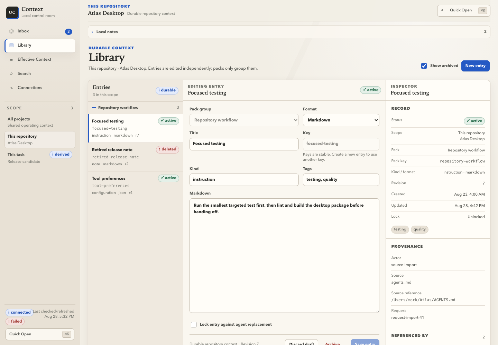

<p align="center">
  
</p>

<h1 align="center">Universal Context Manager</h1>

<p align="center">
  <strong>Local-first, human-governed context shared across AI coding tools.</strong>
</p>

<p align="center">
  <a href="https://github.com/SiluPanda/universal-context-manager/actions/workflows/ci.yml">
    
  </a>
  <a href="LICENSE">
    
  </a>
  
</p>

Universal Context Manager (UCM) gives you one local place to curate the instructions, decisions,
and durable facts that AI coding tools reuse. Instead of leaving context scattered across files or
hidden in opaque agent memory, UCM keeps it **scoped, reviewable, searchable, and reversible**—then
shows the exact ordered context an adapter will receive.

> **Current boundary:** this repository is a working source MVP with a macOS/Tauri desktop focus.
> There is no hosted sync, remote UCM service, or signed/notarized published app or binary release
> yet. The supported installation path is from source.



<p align="center">
  <sub>Desktop browser preview shown with synthetic data.</sub>
</p>

## Start here

Prerequisites: macOS, Rust 1.85 or newer, and `jq`. Codex or Claude Code is optional until you
connect an adapter.

```bash
# From this repository checkout
./scripts/install-local.sh
export PATH="$HOME/.local/bin:$PATH"

# Then, in a project you want UCM to manage
cd /path/to/project
contextctl setup
```

The installer builds `contextd`, `contextctl`, and `context-mcp`, installs them into
`~/.local/bin`, initializes the private local runtime, installs adapters for supported harnesses
detected on the machine, and runs diagnostics.

`contextctl setup` is deliberately preview-first. It detects supported instruction files,
explains proposed imports and conflicts, checks adapters, and composes a real context preview
without importing files or changing third-party configuration.

```bash
# Apply only after reviewing the setup preview
contextctl setup --apply --yes
```

See [Install and onboarding](docs/install-and-onboarding.md) for adapter selection, custom binary
paths, shell completions, and troubleshooting.

## The product at a glance

| Surface | What it is for |
| --- | --- |
| **Inbox** | Review, edit, approve, or reject agent and import proposals before they become durable context. |
| **Library** | Manage approved entries, locks, tags, provenance, lifecycle state, and revision history. |
| **Effective Context** | Inspect the exact backend-composed Markdown, ordering, metrics, warnings, inclusions, and exclusions sent to one adapter. |
| **Search** | Find entries, pending reviews, revisions, activity, and connections, then open the underlying record. |
| **Connections** | Diagnose the daemon, MCP handshake, versions, adapters, spool, and governance policy. |
| **Privacy & Data** | Review local paths and counts, preview backups before import, export scoped data, and clear data explicitly. |

### Scopes

Context composes in a predictable order:

| Scope | Use it for |
| --- | --- |
| **Global** | Guidance that should apply to every connected project. |
| **Project** | Repository-specific architecture, commands, conventions, and decisions. |
| **Task** | Derived, temporary handoff context for a run, issue, or focused piece of work. |

The effective result is always **Global → Project → Task**. UCM preserves entry identity,
provenance, and revision numbers so the result can be explained instead of reconstructed in the UI.

### Governance modes

| Mode | Behavior |
| --- | --- |
| **Strict** | Every non-duplicate proposal waits for review. |
| **Balanced** | Safe project/task proposals may apply; global, conflicting, and locked changes wait for review. |
| **Fast** | Project/task conflicts may apply; global and locked changes still wait for review. |

Credential-shaped content is rejected before persistence in every mode. Every accepted mutation
creates a new, restorable revision rather than rewriting history.

```bash
contextctl policy show
contextctl policy set balanced
```

## Principal workflows

### Stage existing instructions

UCM can detect UCM JSON/Markdown exports plus `AGENTS.md`, `CLAUDE.md`, Copilot instructions,
Cursor rules, Continue rules, and explicit plain Markdown imports.

```bash
# Parse and classify candidates without writing
contextctl source-import preview AGENTS.md CLAUDE.md

# Re-run the preview contract and apply through the active review policy
contextctl source-import apply AGENTS.md

# Resolve anything governance held for a person
contextctl review list --state pending
contextctl review approve <REVIEW_ID> --note "Verified"
```

Previews report new candidates, duplicates, conflicts, and warnings. Apply is atomic and rejects a
stale preview or changed destination state instead of silently applying something different.

### Inspect what a tool will receive

```bash
contextctl compose
contextctl compose --project /path/to/repo --task issue-123
contextctl search "release checklist" --limit 10
```

Human-readable output is the default. Add global `--json` for stable typed output intended for
automation.

### Diagnose and recover

```bash
contextctl doctor
contextctl doctor --repair
contextctl retry-spool
```

Doctor checks component compatibility, storage and socket permissions, daemon reachability, MCP,
spooled writes, and adapter installation. Repair is limited to safe UCM-owned actions such as
creating private directories, starting the daemon, and retrying queued writes; it does not silently
rewrite Codex or Claude Code configuration.

### Restore or move data

```bash
contextctl entry revert --scope project --key build --revision 2
contextctl export --format json --output context.json
contextctl import --format json --input context.json
```

Exports can contain durable context and local project paths. Preview their scope and protect them
like repository documentation.

## Supported adapters

| Harness | Integration | Current status |
| --- | --- | --- |
| **Codex** | Local plugin fixture, fail-open lifecycle hooks, and stdio MCP | Source-installed from this repository |
| **Claude Code** | Local plugin fixture, fail-open lifecycle hooks, and stdio MCP | Source-installed from this repository |
| **Other MCP-capable tools** | Launch `context-mcp serve --adapter <name> --stdio` | Storage/MCP contract is implemented; host packaging is not provided |

The MCP server exposes `compose_context`, `search_context`, and `commit_work`. Session-start hooks
load effective context; post-work updates pass through the same review policy and report applied,
pending, skipped, rejected, or spooled outcomes. Hooks intentionally fail open so a local context
problem does not break the host coding session.

Read [Adapters](docs/adapters.md), [Codex setup](adapters/codex/README.md), or
[Claude Code setup](adapters/claude-code/README.md).

## Architecture

```text
macOS desktop ─┐
contextctl ─────┼──> contextd over a user-only Unix socket ───> SQLite/WAL + private spool
context-mcp ────┘
      ▲
      └── Codex / Claude Code / other local MCP clients
```

- `context-core` owns scopes, entries, reviews, revisions, imports, composition, and search.
- `contextd` is the per-user database writer and local daemon.
- `contextctl` is the human and automation CLI.
- `context-mcp` is the stdio bridge for harnesses.
- `apps/desktop` is the macOS control surface for onboarding, review, editing, explainability,
  diagnostics, and local data management.
- Canonical shared adapter assets live in `adapters/shared/` and are copied into plugin roots by
  `scripts/sync-shared-assets.sh`.

More detail: [Architecture](docs/architecture.md) and [Threat model](docs/threat-model.md).

## Privacy boundary

**Stays local to UCM**

- durable entries, full-text index, reviews, revisions, run records, settings, and queued writes
- SQLite storage and a per-user Unix socket protected by local filesystem permissions
- diagnostics and composition performed by the local UCM processes

**Can cross the boundary**

- an adapter may place selected effective context into a host harness prompt
- that harness may send the prompt to its configured model provider under its own network and data
  policies
- exported bundles may include context and local project paths

UCM enables no cloud sync, analytics, remote listener, or model API. The database is not
application-level encrypted and remains readable to software running as the same macOS user; use
FileVault and normal account isolation. Local persistence does **not** make downstream model
inference local.

## Desktop development

The browser preview is useful for UI work and contains deterministic synthetic data. The Tauri app
uses the live local backend.

```bash
cd apps/desktop
pnpm install --frozen-lockfile
pnpm dev         # browser-only synthetic preview
pnpm tauri dev   # live macOS desktop app
```

## Development and validation

Core/CLI crates currently support Rust 1.85; the Tauri desktop dependency graph requires Rust 1.88.
Node 22 and pnpm 9 are used for desktop development.

```bash
make check
cargo +1.85.0 check --workspace --exclude app --all-targets --all-features --locked
cargo +1.88.0 check -p app --all-targets --locked
```

Adapter or install-flow changes must also keep shared copies synchronized and pass the repository
validator:

```bash
./scripts/sync-shared-assets.sh
./scripts/validate-adapters.sh
```

See [Development](docs/development.md) and [Validation](docs/validation.md).

## Documentation

- [User guide](docs/user-guide.md)
- [Install and onboarding](docs/install-and-onboarding.md)
- [Import and export](docs/import-export.md)
- [Architecture](docs/architecture.md)
- [Adapters](docs/adapters.md)
- [Threat model](docs/threat-model.md)
- [Development](docs/development.md)
- [Validation](docs/validation.md)

## Security

Please report vulnerabilities through a
[private GitHub security advisory](https://github.com/SiluPanda/universal-context-manager/security/advisories/new),
not a public issue. Do not attach real credentials, private context databases, or conversation
data. See [SECURITY.md](SECURITY.md).

## License

Licensed under the [Apache License 2.0](LICENSE).
